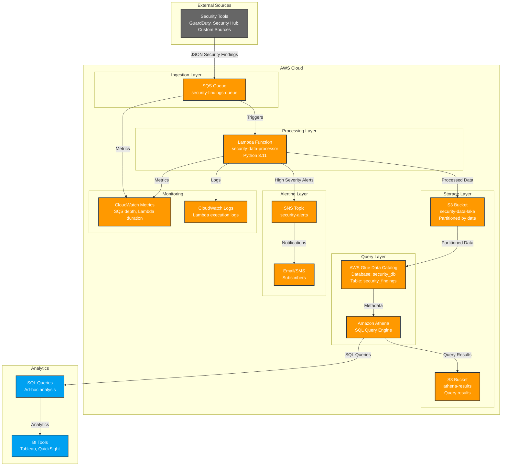

# Serverless Security Data Lake Architecture

## System Architecture Diagram

## Data Flow Details

### 1. Ingestion Phase
- **Source**: Security tools send JSON findings to SQS queue
- **Queue**: Standard SQS queue with 30-second visibility timeout
- **Message Format**: JSON with standardized security finding schema

### 2. Processing Phase
- **Trigger**: SQS event triggers Lambda function
- **Processing**: Lambda normalizes data, validates schema, adds metadata
- **Partitioning**: Data partitioned by year/month/day for efficient querying
- **Storage**: Individual JSON files stored in S3 with event_id as filename

### 3. Storage Phase
- **S3 Structure**: `s3://bucket/findings/year=YYYY/month=MM/day=DD/event_id.json`
- **Lifecycle**: Intelligent tiering for cost optimization
- **Encryption**: AES-256 encryption at rest

### 4. Query Phase
- **Glue Catalog**: Automatically discovers and catalogs S3 data
- **Athena Table**: External table pointing to partitioned S3 data
- **Query Optimization**: Partition pruning reduces scan costs

### 5. Alerting Phase
- **SNS Topic**: High-severity findings trigger immediate notifications
- **Subscribers**: Email, SMS, or webhook endpoints
- **Filtering**: Lambda evaluates severity and routes accordingly

## Component Specifications

### SQS Queue
- **Type**: Standard Queue
- **Visibility Timeout**: 30 seconds
- **Message Retention**: 14 days
- **Dead Letter Queue**: Enabled for failed processing

### Lambda Function
- **Runtime**: Python 3.11
- **Memory**: 512 MB (configurable)
- **Timeout**: 60 seconds
- **Concurrency**: Up to 1000 concurrent executions

### S3 Bucket
- **Storage Class**: Intelligent Tiering
- **Versioning**: Enabled
- **Lifecycle**: Move to IA after 30 days, Glacier after 90 days
- **Encryption**: Server-side encryption with S3 managed keys

### Athena
- **Workgroup**: Primary (default)
- **Query Result Location**: Dedicated S3 bucket
- **Encryption**: Query results encrypted at rest

### SNS Topic
- **Protocols**: Email, SMS, HTTP/HTTPS
- **Message Filtering**: Based on severity level
- **Retry Policy**: Exponential backoff

## Security Architecture

### IAM Roles and Policies
- **Lambda Execution Role**: Minimal permissions for S3, SNS, CloudWatch
- **SQS Access**: Lambda can receive and delete messages
- **S3 Access**: Read/write access to specific bucket and prefix
- **SNS Access**: Publish to specific topic

### Data Protection
- **Encryption in Transit**: TLS 1.2+ for all communications
- **Encryption at Rest**: AES-256 for S3, KMS for sensitive data
- **Access Control**: Bucket policies and IAM roles
- **Audit Logging**: CloudTrail for API call tracking

## Performance Characteristics

### Scalability
- **SQS**: Virtually unlimited throughput
- **Lambda**: Auto-scales based on queue depth
- **S3**: 3500 PUT/COPY/POST/DELETE requests per second per prefix
- **Athena**: Concurrent query limits based on account limits

### Latency
- **SQS to Lambda**: < 1 second
- **Lambda Processing**: 1-5 seconds typical
- **S3 Write**: < 100ms
- **Athena Query**: 1-30 seconds depending on data size

### Cost Optimization
- **S3 Intelligent Tiering**: Automatic cost optimization
- **Lambda**: Pay per request and compute time
- **Athena**: Pay per TB scanned (partitioning reduces cost)
- **SQS**: Pay per request (first 1M free per month)

## Monitoring and Observability

### CloudWatch Metrics
- **SQS**: Queue depth, message age, error rate
- **Lambda**: Duration, errors, throttles, concurrent executions
- **S3**: Request counts, bytes transferred, errors
- **Athena**: Query execution time, bytes scanned

### CloudWatch Logs
- **Lambda**: Structured JSON logs with correlation IDs
- **Error Tracking**: Centralized error collection and alerting
- **Performance**: Query execution time tracking

### Custom Dashboards
- **Data Pipeline Health**: End-to-end monitoring
- **Cost Tracking**: Resource utilization and cost trends
- **Security Metrics**: Finding volume and severity distribution 